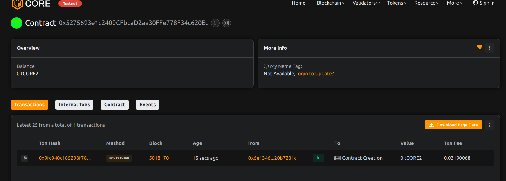

# Project Title: GasHive: Transaction Pool for Gas Optimization 
Project Done By Palak Sahu.

## Project Description

GasHive is an on-chain transaction pool that queues user-submitted data and executes it at more favorable gas prices by a designated executor. It aims to reduce gas costs and enable batch processing.

## Project Vision

To optimize Ethereum gas usage by decoupling transaction submission from execution, offering developers and users a cheaper alternative for non-urgent operations.

## Key Features

- Queue custom calldata with gas thresholds
- Delegated transaction execution
- Track pending and executed transactions
- Designed for batch processing and automation

## Future Scope

- Integration with gas oracles (e.g., Chainlink)
- Incentive model for executors (tips, rebates)
- Cron-style time-based execution
- Public keeper or DAO executor support

## Contract Details
0x5275693e1c2409CFbcaD2aa30FFe778F34c620Ec

-  Project made by Palak Sahu.
-  Project completed on 25th October, 2025.

